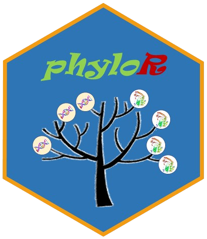

# phyloR: An Automated R Package for Sequence Retrievd and Phylogenetic Analysis in Ecological and Environment Genomics.

[](https://www.gnu.org/licenses/gpl-3.0.en.html)
[](https://doi.org/10.5281/zenodo.XXXXXXX)

## Phylogenetic Analysis Toolkit for R

**phyloR** provides an integrated workflow for molecular phylogenetics, from sequence retrieval to tree comparison. Key features include:

- 🧬 Ortholog identification from major databases
- 🔍 Multiple sequence alignment and trimming
- 🌳 Phylogenetic tree construction (ML/NJ/MP)
- ↔️ Tree comparison and visualization
- 📊 Integrated tidyverse compatibility

## Installation

### From GitHub (Latest Version)
``` r
# Install via remotes (recommended), or devtools
if (!require("remotes")) install.packages("remotes")
remotes::install_github("libcell/phyloR", dependencies = TRUE)
```

### Alternatively, using **install_ciblab()** to install phyloR from our Labsite 

``` r
source("https://ciblab.net/pub/install_ciblab.R")
install_ciblab("phyloR")
```

## Quick Start

### Examples
``` r
library(phyloR)

# Get orthologs
ortho <- get_orthologs(gene = "COX1", 
                       species = c("human", "mouse", "zebrafish"))

# Align sequences
aln <- align_sequences(ortho, method = "mafft")

# Build tree
tree <- build_tree(aln, method = "RAxML")

# Visualize
plot_tree(tree) + 
  ggtree::theme_tree2()
```

### Detailed Guides
| Topic                      | Command/Resource                  |
|----------------------------|-----------------------------------|
| 🧬 Ortholog Retrieval    | `vignette("orthologs")`           |
| 🔍 Sequence Alignment  | `vignette("alignment-methods")`   |
| 🌳 Tree Construction   | `vignette("tree-building")`       |
| ↔️ Tree Comparison        | `vignette("tree-comparison")`     |

### Online Resources
- [ [WEB] Website Docs ](https://libcell.github.io/phyloR/)
- [ [PDF] User Manual ](docs/phyloR_manual.pdf)
- [ [VID] Tutorial Videos ](https://youtube.com/playlist?list=XXX)

## Contact

If you have any question, please email to Feifei Li (<libcell@cqnu.edu.cn>) or raise an issue for that.

## Citation
- If you use phyloR in your research, please cite:
\nZou Y, Zhang Z, Zeng Y, *et al*. Common methods for phylogenetic tree construction and their implementation in R. ***Bioengineering***, 2024, 11(5): 480.
